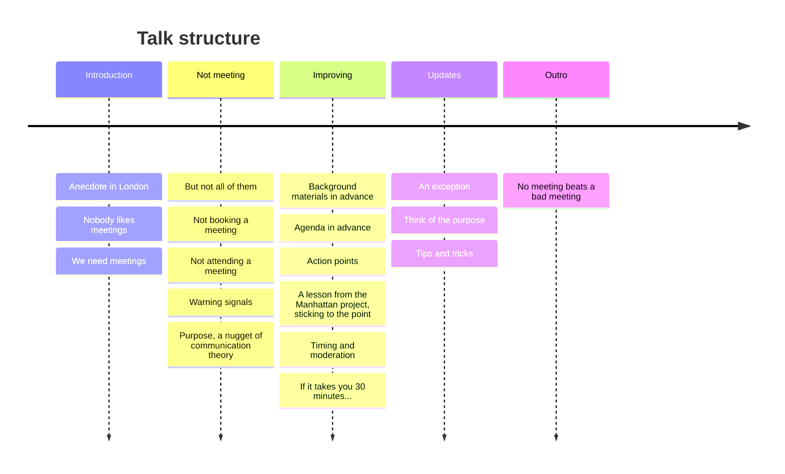

<!-- slide bg="https://github.com/PabRod/autodiff-slides/blob/main/_meta/_img/escience-cover.png?raw=true" -->
# Best practices
## for organizing meetings

By Pablo Rodríguez-Sánchez

note: this will be invisible in the slide
### Mind map

## Tentative outline
- This meeting could have been an email
    - The most effective meeting is a meeting that doesn't take place
- Before the meeting
    - The agenda: why, when and where are we meeting?
    - Estimating the meeting duration: better safe than sorry
    - Background materials: this is not a library (it's a meeting)
    - Rejecting invitations
- How is a meeting different from a corridor conversation
    - Purpose
    - Sticking to the topic
    - Moderating interventions
    - Being on time
    - Ending the meeting with specific action points
- After the meeting
    - Assigning tasks and keeping track

---
## Before we start

[pabrod.github.io/today](https://pabrod.github.io/today.html)

---

note: an anecdote

---
## Nobody likes meetings

+ They interrupt deep work
+ They overrun their schedule
+ Half the room wonders why they're there

--
## Yet we can't stop having them

+ Decisions need to be taken
+ Some problems need real-time input
+ Face to face time builds trust

note: Some things genuinely require everyone in the same (virtual) room:

---
## The most effective meeting...

...is the one that doesn't take place.

note: The best outcome is often avoiding the meeting altogether.

--
## The 0th rule

Before booking, ask yourself:

+ How is this meeting better than an email?
+ Be a silent hero!

--
## Politely declining meetings

+ Can save you time...
+ ... but also others.
+ It is the most **ethical and professional** thing to do

note: Suggest a short formula: "I don't think I can contribute much here. Could you loop me in on the outcome?"

---
# Before the meeting

note: but from now on, let's assume we want to proceed with the meeting

--
## The agenda

+ **Why** are we meeting?
+ **What** needs to be decided or discussed?
+ **Who** needs to be there?
+ **Where and when** does it happen?
+ No agenda = huge warning signal.

--
## Estimating duration

+ Estimate generously. Better safe than sorry. 
+ Nobody minds a meeting that ends too early.
+ Don't concatenate meetings back-to-back.

note: Help the audience develop an intuition for the true cost of meetings.

--
## Background materials

> *This is not a library. It's a meeting.*

+ Send the materials in advance...
+ ... and I don't mean 5 minutes in advance.
+ The meeting is for **discussion**, not for **reading**.

note: Materials sent in advance let people arrive prepared, so the meeting can focus on dialogue rather than information transfer.

--

---
# During the meeting

--

## Sticking to the point

+ Meetings naturally become brainstorming sessions.
+ Particularly in academy.

--

note: another anecdote

--
## Moderating interventions

The chair's responsibilities:

+ Keep discussion on track
+ Give everyone a fair chance to speak
+ Cut tangents. Politely but firmly
+ Tip: use a timer

note: Even informal meetings benefit from someone in the chair role.

--
## Being on time

+ Starting late punishes the punctual.
+ Ending late punishes everyone.

note: and makes you look like someone who doesn't know how to use a clock

--
## Ending with action points

A meeting without action points is just a conversation. Every action needs:
- A clear **task**
- An **owner**
- A **deadline**

---
# After the meeting

--
## Keeping it actionable

- Send a brief summary with action points
- Use a shared tracker

note: The meeting isn't over when people leave the room. It's over when the actions are done.

---
## A special case: updates

+ 🙂 No agenda is needed
+ 🙁 They tend to derail

note: Update meetings (standups, progress reviews) are a common genre. They deserve their own treatment.

--
## Tips for update meetings

- Time each update (e.g. 30 seconds per person)
- No problem-solving during updates. Schedule them separately

---
### A bad meeting is worse than not meeting at all
If you must meet, make it count.

---

<!-- slide bg="https://github.com/PabRod/autodiff-slides/blob/main/_meta/_img/escience-cover.png?raw=true" -->

By Pablo Rodríguez-Sánchez

[pabrod.github.io](pabrod.github.io)

---

# Optional materials

--

### A nugget of communication theory

note: This is a micro-lesson in communication theory. Keep it light and practical.