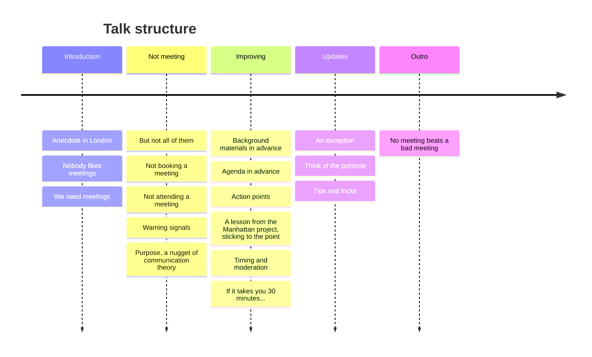

<!-- slide bg="https://github.com/PabRod/autodiff-slides/blob/main/_meta/_img/escience-cover.png?raw=true" -->
# Better meetings
## For a better life

By Pablo Rodríguez-Sánchez

note: this will be invisible in the slide
### Mind map

- This meeting could have been an email
    - The most effective meeting is a meeting that doesn't take place
- Before the meeting
    - The agenda: why, when and where are we meeting?
    - Estimating the meeting duration: better safe than sorry
    - Background materials: this is not a library (it's a meeting)
    - Rejecting invitations
- How is a meeting different from a corridor conversation
    - Purpose
    - Sticking to the topic
    - Moderating interventions
    - Being on time
    - Ending the meeting with specific action points
- After the meeting
    - Assigning tasks and keeping track

---
## Before we start

[pabrod.github.io](pabrod.github.io)

--